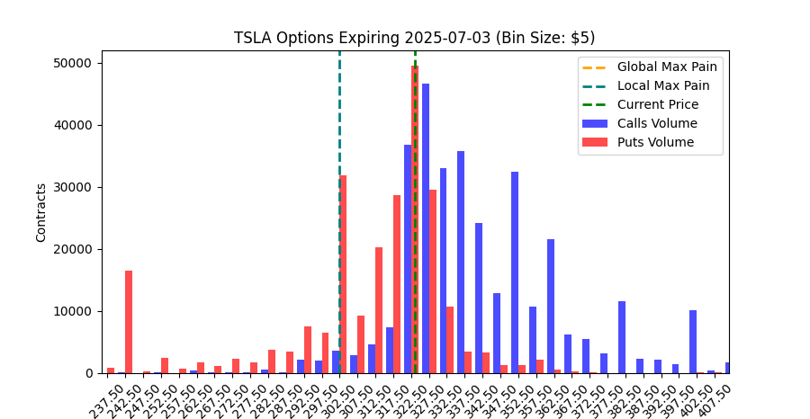

# 📊 Options Max Pain Tracker

A Python GUI app using `Tkinter`, `yfinance`, and `matplotlib` that helps visualize **Options Open Interest**, **Volume**, and calculate **Max Pain** levels for a selected stock and expiration date.

---

## 🔍 Features

- 📈 Fetches live options chain data from Yahoo Finance
- 🧮 Calculates Global and Local **Max Pain**
- 📊 Visualizes:
  - Open Interest and Volume by Strike Price
  - Calls vs. Puts distributions with toggle
- ✅ Highlights whether Max Pain levels fall within ATR range
- 🧭 Includes slider to zoom/pan chart around current price
- 💾 Export both chart and raw options data to local `/data` folder

---

## 🖼️ Example Output

---
